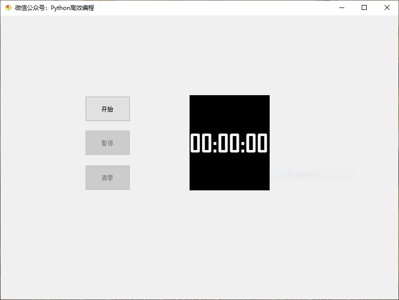
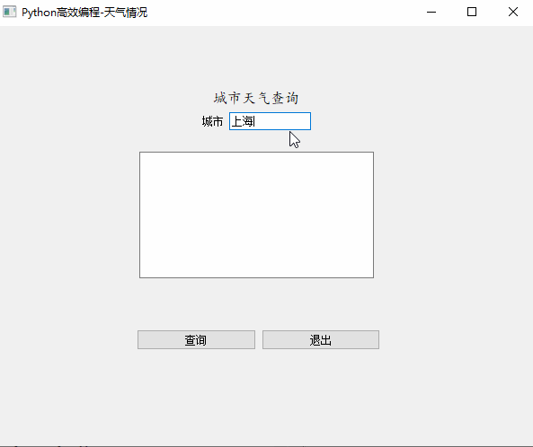
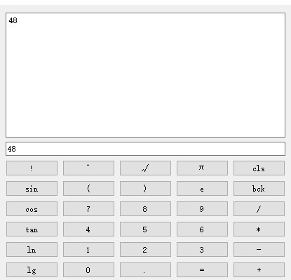
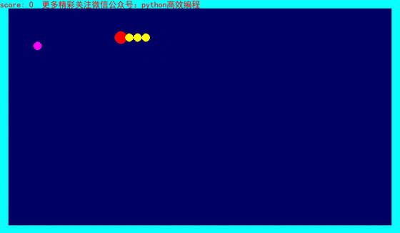
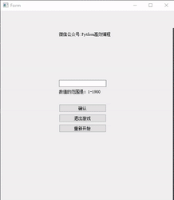
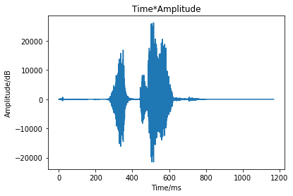
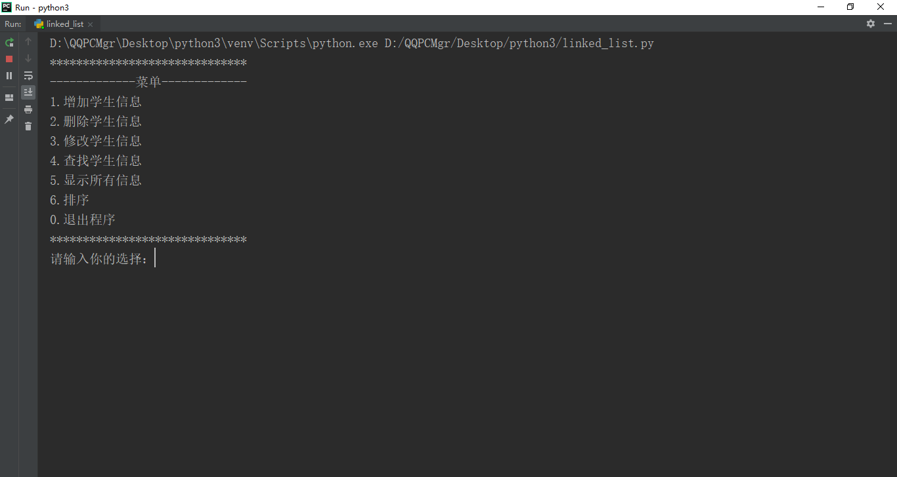
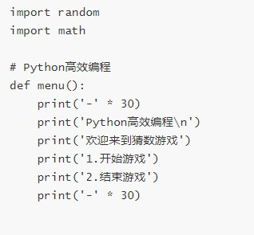

- [关于 Python 的简易小程序](#---python-------)
  * [简易 2048 游戏](#---2048---)
  * [计时器程序(PyQt5)](#------pyqt5-)
  * [天气查询界面(PyQt5)](#-------pyqt5-)
  * [PDF 阅读器](#pdf----)
  * [简易 计算器(PyQt5)](#-------pyqt5-)
  * [简易 贪吃蛇游戏(Pygame)](#---------pygame-)
  * [猜数游戏界面版（PyQt5）](#--------pyqt5-)
  * [简单的语音分类任务入门](#-----------)
  * [简易版的学生成绩管理系统（命令行）](#-----------------)
  * [猜数游戏基础版（命令行）](#------------)

### 关于 Python 的简易小程序 

以下代码在相应文件夹中，教程在微信公众号 `Python高效编程`。喜欢的朋友可以 star 或者分享给自己的好友。前路漫漫，一起加油！

#### 简易 2048 游戏 

使用 curses 库构建一个 2048 小游戏。

#### 计时器程序(PyQt5) 

基于 PyQt5 的计时器程序，使用了 QTimer 模块。

#### 天气查询界面(PyQt5) 

基于 PyQt5 和 天气 api 的天气查询软件。

#### PDF 阅读器 

基于 PyQt5 和 PyMuPDF 的 PDF 阅读器。

#### 简易 计算器(PyQt5) 

基于 PyQt5 和 eval 函数的计算器。

#### 简易 贪吃蛇游戏(Pygame) 

基于 Pygame 的贪吃蛇游戏。

#### 猜数游戏界面版（PyQt5）

基于 PyQt5 的猜数游戏。

#### 简单的语音分类任务入门 

基于 keras 和 librosa 的语音识别任务。

#### 简易版的学生成绩管理系统（命令行） 

基于命令行的学生成绩管理系统

#### 猜数游戏基础版（命令行）

猜数游戏基础版。

以上代码在相应文件夹中，教程在微信公众号 `Python高效编程`。

